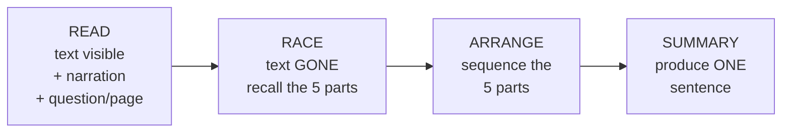
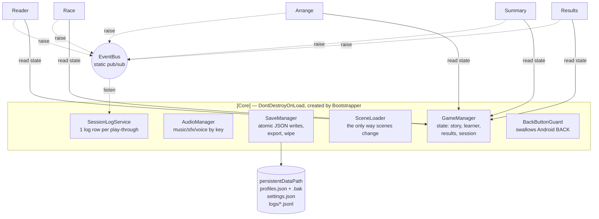
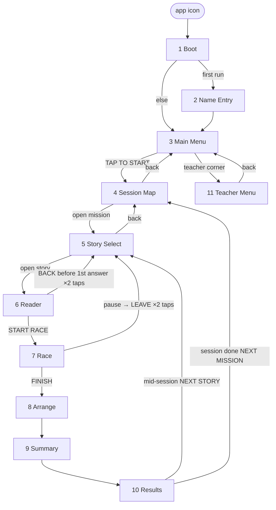
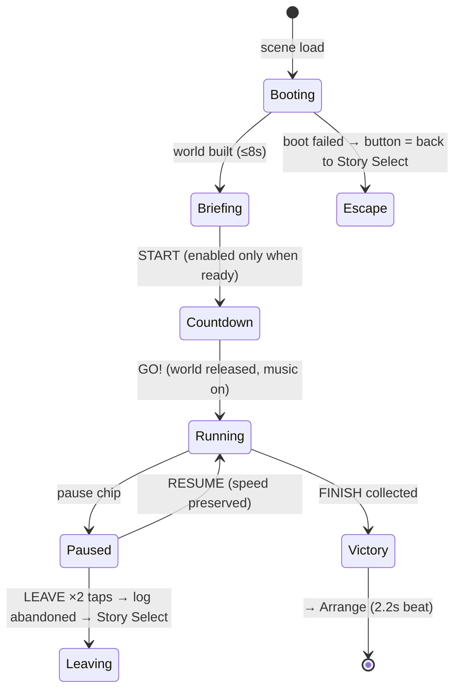
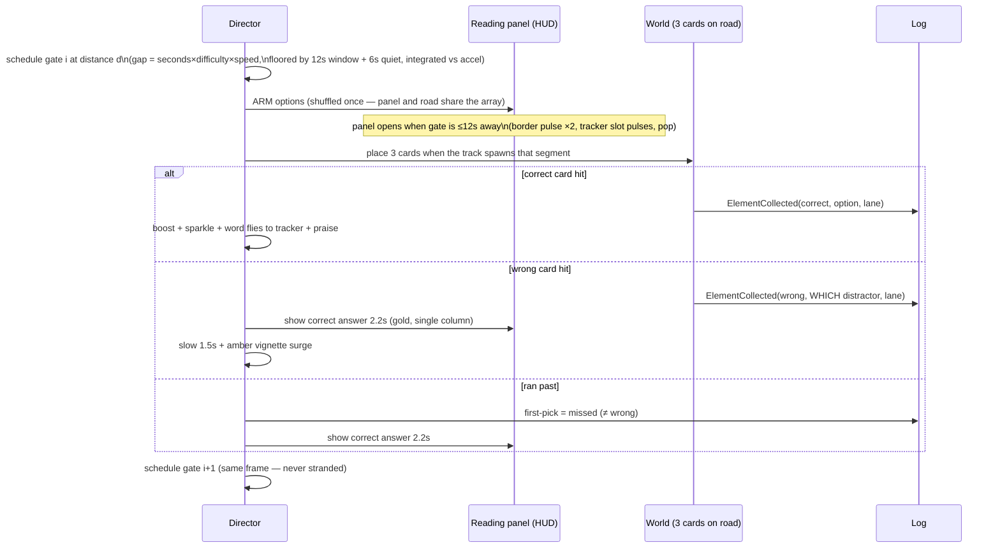

# SUMMARACE — GAME DESIGN & TECHNICAL BLUEPRINT
### (GDD + TDD in one file — the whole project: goal, diagrams, logic, UI, use cases, plan)

**v1.0 · 2026-08-21 · verified against the live build, branch `experiment/endless-override-2`.**
Where any older document disagrees, this file wins.

Evidence base (read in full): the study PDF (103 pp), the researcher's 30-story docx
(byte-identical to the repo copy — content unchanged), all 27 Canva prototype screens, all
29 web-prototype screenshots, the entire build (55 scripts / 16,394 lines, 12 scenes walked
live in the Editor).

---

## 0. TABLE OF CONTENTS

1. Vision & Goals
2. Actors & Use Cases
3. System Architecture
4. Navigation Map (all screens)
5. Screen Blueprints (purpose · UI · logic · transitions · edge cases)
6. The Race — deep logic spec (state machine + gate lifecycle)
7. Data Model (story JSON · save files · the research log row)
8. Content Specification (the 30 stories)
9. UI/UX Change Plan (what we are changing, per screen)
10. Non-Functional Requirements
11. Project Status & Roadmap
12. Ship Procedure
13. Locked Design Decisions & Rationale
14. Risks & Honest Limitations

---

# 1. VISION & GOALS

| | |
|---|---|
| **Product** | SummaRace — *"Read! Race! Summarize!"* |
| **Category** | Offline Android educational game **that is a research instrument** |
| **Purpose** | Intervention tool of a quasi-experimental study: improve Grade-4 learners' summarizing of story events via the **SWBST** strategy (Somebody · Wanted · But · So · Then) |
| **Study shape** | 40 experimental vs 40 control learners · 10 sessions × 55 min · pretest/posttest (paper, human-scored rubric) |
| **Definition of done** | One APK on 40 tablets that plays a full story with Wi-Fi off and writes a data row joinable to that child's paper booklet |

**Pedagogical core — the support-removal ladder** (one story = four stages, support removed
one step at a time):



**North stars (invariants — never violated by any screen, ever):**
1. **Never punish** — no game-over, no restart, no time-out, no red scolding, no being caught.
2. **The measure is sacred** — the race's first pick per element is the headline research
   variable; nothing on screen may hint the correct option; nothing the child didn't choose
   may reach the log.
3. **Offline · private · recoverable** — zero networking; pseudonymised data; atomic saves;
   every screen always has a working exit.

---

# 2. ACTORS & USE CASES

**Actors:** LEARNER (age ~9, possibly struggling/ESL reader) · TEACHER/RESEARCHER (via PIN) ·
ANALYST (consumes the exported data; never touches the device).

### UC-1 · Learner completes a story (the happy path)
1. Learner taps the app icon → Boot splash → Main Menu ("Playing as <name>").
2. TAP TO START → Session Map → taps an open mission → Story Select.
3. Taps the open story card (PLAY ring) → Reader.
4. Reads 5 pages (narration auto-plays), answers 5 questions (first answers logged).
5. START RACE → briefing → START → 3-2-1-GO → collects 5 SWBST parts → FINISH.
6. Arranges the 5 parts (verify → all green) → writes one sentence → Results.
7. Sees stars, gems, main idea, their own sentence → NEXT STORY (or NEXT MISSION after the
   3rd) → the log row for the run is complete on disk.

### UC-2 · Learner answers wrong / misses (the protected path)
- Reader wrong: correct option lights up; "Not quite — here is the answer!"; moves on.
- Race wrong pick: pick logged (which distractor, which lane) → brief slow → amber surge →
  correct answer displayed 2.2 s → next gate. Race never ends.
- Race gate run past: logged as **missed** (≠ wrong) → answer displayed → next gate.
- Arrange stuck: hint after 3 misses on one piece; after 4 failed verifies the app finishes
  the board *with* the learner (logged `assisted`) and continues.
- Summary weak: at most 2 targeted nudges → always accepted.
**Postcondition of every branch: the learner reaches Results with ≥1 star; the log is honest.**

### UC-3 · Teacher opens the next session
Main Menu → teacher corner → enter PIN → "Unlock next session" → confirmation names the
session number. (Wrong PIN ×5 → 30 s cooldown. Save-failure is reported, never faked.)

### UC-4 · Researcher exports the data
Teacher corner → PIN → Export → screen shows the full path → connect USB →
`adb pull /sdcard/Android/data/com.orbitsdev.summarace/files/` → one combined `.jsonl` +
learner roster. Empty tablet vs failed write produce **different** messages.

### UC-5 · A second learner joins a shared tablet
Teacher corner → PIN → "+ New learner" → prompted for the **participant code** (from the
child's paper booklet; duplicates refused) → Name Entry (child types name, picks avatar) →
Main Menu. All rows of each child stay in separate files keyed by their own ids.

### UC-6 · The PIN is lost (or a child set one)
Enter-PIN screen → leave box EMPTY → hold OK 6 s → "Reset this tablet?" → two taps →
full wipe + back to PIN setup. (Only recovery possible — the PIN is a salted hash. Cost:
everything on that tablet. Export first.)

### UC-7 · The tablet dies / is backgrounded mid-story
Every backgrounding snapshots the run to disk (`isPartial: true`). A dead battery costs at
most one screen of data. On a handover mid-run, the open row closes against the *previous*
learner (`abandonReason: learner_switched`).

### UC-8 · The race cannot boot (e.g. APK without Addressables content)
Briefing waits max 8 s → the START button becomes "Back to Story Select" with an apology in
the game's own voice — escapable, never a trap; the cause is logged for the adult.

---

# 3. SYSTEM ARCHITECTURE



**Rules:** features never call each other — they raise events and read `GameManager`; all
tuning numbers in `GameRules`, all learner-facing strings in `GameText`, colours in `Theme` +
`SwbstPalette` (the 5 element colours are a teaching device, never re-tinted); scene names in
`SceneNames`. Optional UI chrome **self-builds at runtime** when a scene doesn't wire it
(splash bar, back/replay/done-typing chips, the entire race HUD) so nothing ships broken by a
missed scene edit. Third-party engine (endless runner) is untouched except three guarded
lines; its menus/score/game-over are unreachable.

**Key events:** `StoryStarted · PageAnswered · ReadingCompleted · ElementCollected ·
RacePauseChanged · RunAbandoned · RaceCompleted · ArrangeVerified · SummarySubmitted ·
StoryCompleted · LearnerChanged · SaveFailed · AllDataErased`.

---

# 4. NAVIGATION MAP



Global: Android BACK is inert app-wide (a guard refuses quit) · scene changes go through one
loader (fade + SWBST tip card + progress bar; the tip is spoken only entering the 4 learning
screens) · any scene opened without a story rescues to Story Select ("never a dead end").

---

# 5. SCREEN BLUEPRINTS

Format per screen: **Purpose · UI · Logic · Transitions · Edge cases**.

### 5.1 Boot
- **Purpose:** initialize; route.
- **UI:** sky backdrop, crown + SUMMA/RACE! lockup, tagline "Read! Race! Summarize!",
  "Loading…" + gold fill bar (2 s).
- **Logic:** create `[Core]`; load settings→volumes; load learner profiles (repair null/
  duplicate ids; create first profile if none); raise `AppReady`.
- **Transitions:** learner unnamed → Name Entry (once) · else → Main Menu.
- **Edge:** re-entry skips singleton creation but still splashes; unwired bar self-builds.

### 5.2 Name Entry
- **UI:** title, name input (placeholder "Your name"), "Pick your runner!" + 4 avatar buttons
  (heart/star/gem/lightning — shape AND colour differ), LET'S GO, DONE-TYPING chip (only
  while the field has focus).
- **Logic:** empty name ⇒ keep "Runner" (never an error); selection highlights; confirm
  persists `displayName/avatarIndex/named=true` (checked write).
- **Transitions:** LET'S GO → Main Menu.
- **Edge:** double-confirm latched; keyboard always dismissible; music starts here on a
  fresh device (first screen ever seen).

### 5.3 Main Menu
- **UI:** backdrop, lockup, tagline, TAP TO START (ringed CTA), "Playing as <name>" navy
  pill, low-contrast teacher corner.
- **Logic:** wires all buttons **before** any redirect; unnamed learner → one Name-Entry
  detour (loop-proof flag).
- **Transitions:** start → Session Map · teacher → Teacher Menu.

### 5.4 Session Map
- **UI:** board, 10 stops bottom-to-top (number, lock icon, glow on the current one, 3
  mini-stars each), hint line with dark backing, back.
- **Logic:** open ⇔ `n ≤ learner.unlockedSession`; stars = completed stories in that
  session; celebration plays once when arriving right after finishing a session's 3rd story.
- **Transitions:** open stop → sets session → Story Select · back → Main Menu.
- **Edge:** locked tap = wiggle + lock punch + hint re-shown (visible on muted tablets); no
  learner (editor test) ⇒ everything open.

### 5.5 Story Select
- **UI:** banner, 3 hero-art cards with difficulty chips (EASY green / AVERAGE / HARD),
  stars-earned row, PLAY badge + breathing gold ring on the open card, padlock + "Locked" +
  hint on closed ones, back.
- **Logic:** Easy always open; each next difficulty needs the previous completed; a story
  that fails to load is announced unavailable AND does not lock the ladder.
- **Transitions:** open card → `StartStory` (raises `StoryStarted`) → Reader · back → Map.

### 5.6 Reader
- **UI:** top row: page/question badge + pages progress bar + VOICE toggle + HEAR AGAIN
  chip · story card (hidden during questions) · question panel: title bar + 3 wrapped option
  buttons `A./B./C.` + feedback line · NEXT / NEXT PAGE / START RACE · BACK chip
  (conditional) · Ms. Lumi + speech bubble (hidden during questions).
- **Logic:**
  - Page: narration auto-plays if VOICE on; NEXT → question (per page).
  - Question: options **shuffled per page** (source is position-biased); first tap =
    committed answer → `PageAnswered` (first per page = data); correct option always
    revealed; praise / gentle correction; NEXT.
  - BACK: shown only on a *reading page* AND before the *first* answer of the run; two-tap
    arm/confirm; disarms after 4 s.
  - Last question → NEXT reads START RACE; hand-off latched (double-tap can't zero the
    logged reading time).
- **Transitions:** START RACE → `ReadingCompleted` → Race · BACK (allowed window) → Select.
- **Edge:** page without narration hides HEAR AGAIN; wrong answer never blocks; music is
  stopped here (narration is the accessibility support — nothing plays under it).

### 5.7 Race
- **Purpose:** the instrument's core — unsupported recall of the 5 SWBST parts.
- **UI (HUD, top to bottom):**
  - **SWBST tracker** — 5 wooden plaques: collected words filled in, current target pulsing
    in its element colour, upcoming "?".
  - **Pause chip** (top-right gutter, 48 dp) → pause overlay (RESUME / two-tap LEAVE).
  - **Reading panel** (sky band) — the 3 options as readable text in lane order, identical
    styling; **each column is a tap target that steers to its lane**.
  - **⏳ Gate timer chip** *(being added — §9)* — counts down the REAL seconds until the next
    gate arrives ("Gate in 12s… 11s…"). Honest urgency: at 0 the gate is simply there; the
    normal pick/miss rules apply. No global race countdown, ever (L1).
  - **Feedback pill** — praise on correct; on wrong/miss the panel itself shows the correct
    answer in gold for 2.2 s.
  - **Amber vignette** — screen-edge surge for ~2 s after a wrong pick; the **patrol cameo**
    *(being added — §9)* sweeps the frame edge during this surge; never catches (L3/L4).
  - **Banner** — final-stretch only: "Run to the FINISH!".
- **World:** 3-lane road, one gate (3 cards) live at a time, story-seeded world recipe
  (theme/zone/sky/greenery/light/weather), Ms. Lumi briefing before, 3-2-1-GO countdown.
- **Logic, transitions, guarantees:** deep spec in §6.

### 5.8 Arrange
- **UI:** "Put the story parts in order!" title · 5 slots (SOMEBODY…THEN, pastel element
  colour + element-ink label when empty; cream + text when filled; green when locked) · 5
  full-width wrapped pool pills (shuffled) · UNDO · VERIFY · status line · Ms. Lumi badge.
- **Logic:** tap piece → tap empty slot places it; tap filled slot returns it; UNDO pops the
  last placement; VERIFY: correct slots lock (sound per lock), wrong wiggle amber and
  return; every submitted order logged; hint after 3 misses on the same piece (and always on
  the last attempt) — teaches that element's definition; after 4 failed verifies →
  **assist**: remaining pieces placed visibly, `ArrangeVerified{assisted}` logged, continue.
- **Transitions:** solved or assisted → Summary (never anywhere else; this stage is one-way).
- **Edge:** board is uninteractable during verification animation; locked-slot tap answers
  with lock sound + label punch ("that one is done"); empty-slot tap with nothing in hand
  re-shows the instruction; menu music resumes here (Reader had silenced it).

### 5.9 Summary
- **UI:** "Write your summary!" (Lumi bubble) · reference card listing the 5 parts
  (colour-coded, readable ink) · sentence-frame bubble ("Somebody wanted ___, but ___, so
  ___, then ___") · input (≤200 chars) · nudge line · SUBMIT · DONE-TYPING chip.
- **Logic:** checks = ≥5 words · single sentence · mentions the Somebody; failing check ⇒
  the MATCHING nudge (max 2) ⇒ then always accept; nudge clears when typing resumes;
  `SummarySubmitted{text, nudgeCount}`; text stored for Results.
- **Transitions:** accept → Results. One-way.
- **Edge:** double-submit latched; keyboard never covers the only exit; broken content
  (no elements) passes rather than nudging unfixably.

### 5.10 Results
- **UI:** story title · 3 star sockets · treasure chest + 5 SWBST letter-gems · praise line ·
  Main Idea card · "You wrote:" card with the child's sentence (rich-text OFF — a child's
  `<` must render) · NEXT STORY / NEXT MISSION.
- **Logic:** stars from race first-picks (3★=5/5 · 2★=3–4 · 1★ floor); gems dim per missed
  element; `CompleteStory` persists progress (best stars never decrease) and completes the
  log row; button label AND destination derive from the same session-complete test.
- **Transitions:** mid-session → Story Select · session done → Session Map (celebrates).
- **Edge:** the exit button is re-shown by a `finally` — no exception can strand the screen;
  empty summary ⇒ no card (never an empty frame).

### 5.11 Teacher Menu
- **UI:** one input + one submit (multi-purpose), status line, action column (Participant
  code · Switch learner · Unlock next session · Export logs · Delete all data), back,
  learner-picker overlay (scrollable, code-first rows, "+ New learner").
- **Logic (gate):** state machine EnterPin / CreatePin→ConfirmPin / Recovery /
  ParticipantCode; 5 wrong → 30 s cooldown; recovery = 6 s hold on empty box → warned
  two-tap erase. Raw PIN never stored (salted SHA-256; crypto preserved against stripping).
- **Logic (actions):** unlock reports the number or the exact failure; export distinguishes
  "nothing to export" from a FAILED write, backfills participant codes onto old rows, writes
  the roster, warns on missing/duplicate codes; delete = two taps, disarmed by any other
  action; every rejection sounds different from success.

---

# 6. THE RACE — DEEP LOGIC SPEC

### 6.1 High-level state machine



### 6.2 Gate lifecycle (×5, then FINISH)



**Hard guarantees:** one live gate (monotonic id — a stale card can never fire) · a frame
hitch cannot tunnel a gate (frame-delta cap 0.1 s; trigger depth 3 m vs ≤1 m/frame travel) ·
lane triggers cannot overlap two lanes · a re-presented FINISH cannot be missed forever
(re-schedules) · stranded-run watchdog (2 s) resolves the current element as a miss and
moves on · every timeScale/audio freeze is restored on every exit path.

**Steering surfaces (all equivalent):** tap the reading-panel column = that lane · tap the
screen third = that lane · their swipe (1 lane/swipe) · A/D keys. Taps on the pause chip or
panel are blockers — one gesture can never also steer.

**The worlds:** per session — theme (Day/Night) + zone family + accent mix + sky dome +
greenery + light + optional weather (rain/snow/motes on 6 of 10) — all **story-seeded**:
every learner runs the identical s04_hard (an instrument requirement, not a nicety).

**Difficulty lever:** gate spacing × Easy 1.25 / Average 1.0 / Hard 0.8 — never below the
reading-window floor.

---

# 7. DATA MODEL

### 7.1 Story JSON (generated by `Tools/StoryPipeline/` — never hand-edited)
```
id "s04_hard" · session 1..10 · difficulty easy|average|hard · title · heroImage (path)
world (one of 10) · mainIdea
pages[5]     { text, narration(path), question{ text, options[3], correctIndex } }
elements[5]  { type SOMEBODY..THEN, correct, distractors[2] }   // S-W-B-S-T order
```

### 7.2 Device files (persistentDataPath)
```
settings.json   volumes, haptics, narration, teacherPinHash(salted), activeLearnerId
profiles.json   [ { id(guid), displayName, avatarIndex, named, unlockedSession,
                    progress[{storyId,bestStars,completed}], participantCode } ]
logs/<learnerId>.jsonl   one line per run-write (see 7.3)
```
Writes are atomic (tmp → replace, `.bak` kept, reads fall back); the post-study wipe removes
every copy including old exports and the engine's own save.

### 7.3 The research log row (schema 6) — the study's in-app dataset
| Group | Fields |
|---|---|
| Identity | runId, isPartial, learnerId, **participantCode**, deviceId(hashed), deviceModel, appVersion, schemaVersion |
| Context | storyId, session, difficulty, narrationOn, isReplay, startedIso/finishedIso/rowWrittenIso, lastPhase, abandonReason |
| Reader | readingPageIndices[], readingFirstChoices[], readingFirstCorrect[] |
| Race | raceFirstPickCorrect[5] (**the headline measure**), raceFirstOutcome[5] correct/wrong/**missed**, raceWrongPicks[5], racePicks[] {element, option, text, lane, correct, represent, atSeconds}, raceRunSeconds, racePauseCount/PausedSeconds, timesCaught(≡0) |
| Arrange | arrangeAttempts, arrangeSolved, arrangeAssisted, arrangeOrders[] ("01324" = But/So swap; entry 0 is the unconstrained measure) |
| Summary | summaryText (verbatim), nudgeCount |
| Clocks | per-phase seconds + per-phase backgroundedSeconds (counted, never subtracted) + totalSeconds, starsEarned |

---

# 8. CONTENT SPECIFICATION — the 30 stories (10 × 3, all verified through the real loader)

| Mission | Easy | Average | Hard | World |
|---|---|---|---|---|
| 1 | The Playground | The Day the Crayons Quit | The Animal Assignment | morning_suburbs |
| 2 | Escaping the Room | Seeking a Friend | Shawn the Speedy Snail | bright_park |
| 3 | Emma's Favorite Restaurant | The Case of the Missing Lunch | The Selfish Giant | sunset_town |
| 4 | A Visit to the Zoo | Be Careful What You Wish For | AgitAgueda | blue_hour_suburbs |
| 5 | The Crowded House: A Folktale | Owen and Mzee | In Grandfather's Day | overcast_industrial |
| 6 | You Can't Always Tell | Shuffle to Buffalo | In Grandfather's Day ⚠ | golden_fields |
| 7 | The Boy With the Ball | Sploosh! | First Day at the Factory | night_city |
| 8 | An Ice Idea | How to Skateboard | Anansi and the Cook Pots | misty_morning |
| 9 | A Pool Fit for a Hedgehog | First Fast | Baba Yaga, the Girl, and the Hedgehog | autumn_lane |
| 10 | Why Does the Ocean Have Waves? | Clara Barton: Civil War Hero | We Also Serve | starlit_finale |

⚠ = sessions 5 & 6 share the Hard title (different passages, contradicting SOMEBODY answers)
— researcher sign-off item. **Difficulty basis:** the researcher's own authoring (passages
step up per day); the app adds only the gate-time lever. **Assets:** 30 hero images (real
art), 150 story narration clips + 10 instructional clips (one voice), Ms. Lumi 23 poses +
14 badges.

---

# 9. UI/UX CHANGE PLAN (per screen — the work we are doing now)

### 9.0 TIME IN THE GAME — the whole-game policy (the prototype had 3 timers)

| Where | Prototype | This game | Why |
|---|---|---|---|
| **Race** | 90 s global countdown | 🔨 **⏳ gate-arrival timer** ("Gate in 12s…") — a REAL countdown to the next gate; at 0 the gate simply arrives, normal pick/miss rules apply | urgency restored honestly; a *global* race clock would score reading speed and imply a time-out fail state (L1) |
| **Arrange** | "30 SECS" red chip | 🚫 no countdown | sequencing under panic measures panic, not structure knowledge; the screen already ends itself via the assist ladder — it cannot drag forever |
| **Summary** | "25 SEC" chip | 🚫 no countdown | the produce stage must not be rushed — it is the rehearsal of the paper test, which is also not per-sentence timed |
| **Results** | — | ❓ **NEW OPTION: show the finished time** — "Your race: 1:42!" (and best time on replays) | time shown AFTER the task is pure celebration: the racing fantasy gets its clock with zero pressure during learning; replays are already marked in the data. ~30 min |
| **Everywhere** | — | ✅ invisible clocks | every phase duration (minus paused/backgrounded) is already logged for the researcher — the child just never sees a ticking clock while learning |


**Legend:** 🔨 do · ✅ done · ❓ owner decides · 🚫 stays out (recorded once so it stays closed)

> **Status 2026-08-21 — the safe-polish batch below is BUILT** (compile-verified against
> `Assembly-CSharp`; **not yet seen running** — the Editor has a queued domain reload, so
> nothing here has had a portrait eyeball). Everything is code + two assets; **no scene was
> edited**, so each change degrades to the old screen if a reference is missing. The two
> playtest items (gate-countdown chip, patrol sweep) and all four ❓ decisions are untouched
> and still open. Three things came out different from the wish-list above — each is marked
> and explained in its row.

| Screen | Change | Effort |
|---|---|---|
| Story Select | ✅ difficulty chip colours to prototype. AVERAGE tan · HARD red-orange. **Found while doing it:** every chip label is white and white-on-the-old-orange measured **2.45:1**, below WCAG AA even for large text — so AVERAGE also got dark-brown ink (6.18:1). Tan could not be a tint (an Image multiplies, and tan needs *more* green and 4× the blue than the kit orange has), hence one new asset: the kit's own GOLDEN pill copied to `Resources/UI/chip_tan.png`, same 9-slice border, loaded at runtime so no scene edit was needed | done |
| Reader | ✅ per-question hint line, keyed by page → SWBST slot (`GameText.ReaderSlotHints`). Self-builds into the question card's one empty band (measured: question ends at 0.80, option A starts at 0.72). Names the slot, never the answer — identical across all three options and all 30 stories, so it cannot be used to pick without reading. **No 💡 glyph:** Fredoka/Nunito SDF carry no emoji, so a literal lamp renders as a missing-glyph box on the tablet; the line is set in italic slate instead | done |
| Reader | ❓ persistent coach line "As you read, think about what is really important." | 15 min |
| **Race** | ✅ **Honest timer** — a chip counting the REAL arrival of the next part, integrated against the runner's acceleration (metres/speed overstates it; a chip that says 8s and delivers 6 is worse than no chip). Lives in the banner band, which is free **by construction**: the banner only ever carries text for element 5 and the chip only ever shows for 0–4. Hidden explicitly on pause and finish, because `Update` returns early on both and it would otherwise freeze mid-count. Wording is **"Next part in 8s"**, not "Gate in 8s" — *gate* is the designer's word and the learner is never taught it, while *story parts* is the vocabulary Arrange and Summary already use. Playtest lever kept: `GameRules.RaceGateTimerVisibleSeconds` (12 → 5 shows only the last five seconds; 0 removes the chip) | done |
| **Race** | ✅ **Safe patrol cameo** — and the reason it can work this time is a change of geometry, not of tuning. All three retired chases held the cop at a *small offset* from the runner, and under this camera (5 m back, 4 m up, 14.95°, FOV 58.7, portrait) a small offset has no valid solution. The cameo never holds an offset: he appears on the shoulder **5–10 m AHEAD**, sweeps in and back out over the 2 s surge, then hides. **Solved against the camera read out of the scene file, not eyeballed:** worst projected corner **0.812** of the frame half-extent across the whole sweep on both shoulders — fully in frame with 19% margin — at \|x\| 2.5, which is outside the outermost answer card (2.2) and inside the corridor F54 measured free of props (3.0). Overlap is **impossible by construction**: 5 m of along-run separation, so no stride, lane change or smoothing lag can close it. Locked in by a new fixture, `PatrolCameoGeometryTests`, which **reads the camera from `MainSummaRace.unity`** so a future camera retune fails there instead of on a tablet. Own kill-switch (`RacePatrolCameoEnabled`); the retired chase stays off and untouched. Briefing line is **"If you miss a part, the patrol races past. It never catches you!"** with its own narration clip on the same switch — not "PATROL IS COMING!", which shouts and is not true: nothing comes for the learner, `timesCaught` is 0, and threatening a catch that cannot happen is the opposite of never-punish (D7/L3) | done |
| Race | ✅ wrong-pick line rotation (`GameText.RaceWrongLines`, 4 lines, shuffle-bag via `Praise.RaceNotQuite`). The pill had been showing the correct answer *and* the panel then showed it again — the same sentence twice, saying nothing about why the pick was wrong. Pill now carries the framing line in amber, panel keeps the answer in gold | done |
| Race | ❓ reading window 12 s (100 wpm) vs 17 s (70 wpm) — one constant; time one race first | 5 min + test |
| **Arrange** | ✅ (a) dashed gold frame around the 5 slots — a tiled one-dash sprite on four strips, inserted at Slot_0's **sibling** index so it draws behind them (a child would paint over: the F58ⓓ bug) · (b) pool pills warm-yellow — they had been **byte-identical** to a filled slot (0.96, 0.87, 0.70), so the board never showed what was left to do; now pastel = empty, yellow = to place, cream = placed, green = locked · (c) Lumi line in the bubble, **and `vo_arrange_title.mp3` re-recorded to match** (the title is narrated; changing the text alone would have desynced the one support a non-reader has), title autosizing turned on because it was pinned at 34pt and the longer line fit only by luck · (d) **already done** — VerifyButton has used the kit's green pill all along. Label stays "CHECK ORDER", not "VERIFY ORDER!" (`GameText.VerifyLabel` deliberately avoids the designer's word) | done |
| Arrange | ❓ NEED HINT? on-demand button alongside the auto-hint | 30 min |
| Summary | ✅ story-specific ghost from the story's own S+W, breaking off at "but…" so the three parts the summary is judged on stay the learner's. **Verified against all 30 stories, 0 malformed** — which needed a strip rule: 24 WANTED lines start "To …", 5 are bare noun phrases, and `s01_easy` alone starts "She wanted …", so without it the very first story every learner plays would read "Molly wanted she wanted to swing" | done |
| Summary | ✅ tips block, on the navy pill in the one empty band (below SUBMIT, y 0.02–0.11). The Android keyboard covers that band while typing — correct, not a defect: these are pre-writing tips, and everything needed mid-sentence (frame, reference list, DONE TYPING) is above the keyboard line | done |
| Results | ✅ Ms. Lumi badge — she was on every other learning screen and missing from the one that congratulates. Built (this scene had no avatar object at all), named `TeacherAvatar` so the existing `AttachBadge` guards apply, placed left of the stars because the top-left corner here holds the trophy banner. **Praise line reworded:** "you're a summarizing superstar" praises the CHILD, and every pool in `GameText` is deliberately process praise for a documented reason (ability praise makes learners avoid harder tasks — it was already drifted-and-fixed once in F47ⓗ). Same moment, same volume: **"You summarized the whole story!"**. Say the word and the prototype line is a one-line change | done |
| — | 🔨 *banked 2026-08-21:* praise line "That belongs in your summary!" · Arrange labels wrap-then-shrink hardening | done |
| All | 🚫 global countdown timers · score/multiplier · emoji icons on options · catch/game-over/restart · auto-fill summary · red error flashes | see §13 |

**Execution order:** ~~the ~4 h of safe polish~~ **done** → ~~the two playtest items
(gate-countdown chip, patrol sweep)~~ **done** → decide window & board-frame during that
playtest → ship (§12). Nothing here blocks the APK.

**Every 🔨 item in this table is now built.** What remains in §9 is the four ❓ owner decisions,
which are deliberately untouched.

> ### ⛔ Blocker found 2026-08-21 — the EditMode tests cannot run, and neither can Play mode
>
> `Assembly-CSharp-Editor` does not compile, for a reason that is **not in this repo**:
>
> ```
> Library/PackageCache/com.adjoint.editor@2be1a802c4db/Editor/Windows/Adjoint/AdjointToolbarButton.cs(156,35):
> error CS0433: The type 'AssetPathUtility' exists in both
>   'Adjoint.Editor' and 'MCPForUnity.Editor'
> ```
>
> Two installed packages — `com.adjoint.editor` and `com.coplaydev.unity-mcp` — both ship that
> type, so the editor assembly fails and **all 11 test fixtures are unloadable**: Test Runner ▸
> EditMode ▸ Run All finds exactly **one** test, and it is Addressables' own doc stub. The same
> failure blocks `SummaRace ▸ Build Preflight` and entering Play mode.
>
> This is why §11 phase 5 has never been closable, and it is **on the critical path to the APK**
> (§12 step 0 is "run the tests and record the count", step 4 is "fix every preflight ✖").
> Resolving it means updating or removing one of the two packages — an owner call, since one is
> the Adjoint toolbar and the other is the Unity MCP bridge.
>
> The runtime assembly (`Assembly-CSharp`) is unaffected and compiles clean; everything in this
> pass was verified against it with Unity's own Roslyn.

**First thing to do on the next Editor session:** click the Unity window once to release the
queued domain reload (§12 step 0), then walk Reader → Arrange → Summary → Results in
portrait. Nine of the changes above are laid out from measured scene coordinates but have
never been rendered, and this project's own history says layout bugs are invisible in code
and in the landscape game view.

---

# 10. NON-FUNCTIONAL REQUIREMENTS

| Requirement | Target | Status |
|---|---|---|
| Offline | zero networking/ads/analytics/IAP | ✅ enforced by automated test + preflight (packages have self-returned twice; the test is the guard) |
| Device floor | 2 GB RAM · Android 8+ (minSdk 26) · 30 fps in the race | RAM budget applied (~127 MB reclaimed); fps unmeasured until first device run; first lever = scenery cap 14→7 |
| APK | ≤ 300 MB | est. ~190–230 MB **after** the hero-art import fix (−50 MB) |
| Input | portrait; touch primary (tap-to-lane + swipe), WASD desktop; legacy+new input BOTH (their touch path needs legacy) | ✅ preflight-guarded |
| Accessibility | narration everywhere non-scored · colour never the sole channel · autosizing floors (~22–24 pt min) · 48 dp touch targets · no strobe (pulse ≤1.85 Hz) | ✅ audited |
| Privacy | pseudonymised rows; hashed device id; no names in the export body (roster separate); wipe honours consent incl. backups & old exports | ✅ |
| Robustness | atomic saves + .bak; snapshot on background; never-a-dead-end; every freeze restored on every exit | ✅ audited |

---

# 11. PROJECT STATUS & ROADMAP

| Phase | Status |
|---|---|
| 0 Foundation (goal, architecture, offline, never-stuck) | ✅ |
| 1 Content (30 JSONs, pipeline, voice, art) | ✅ — except 🔧 hero-art import settings (−50 MB) and 🟡 researcher sign-off |
| 2 All 11 screens built & audited | ✅ (+ §9 polish list) |
| 3 Race core (gates/panel/tracker/worlds/pause) | ✅ — 🟡 patrol cameo & window decision |
| 4 Study machinery (log schema 6, codes, PIN, export, atomic saves) | ✅ |
| 5 Quality (device budget, audits, tests+preflight) | 🔧 tests & preflight compiled but awaiting ONE editor domain-reload (click the Unity window once), then run & record the count |
| **6 SHIP** | ⬜ **the only phase with real work left** — §12 |
| 7 Study operations | ✅ built; rituals in §12 |
| 8 Post-study wishlist | park-style track art · girl runner tied to avatar · menu Lumi cameo · CC0 audio swaps · legacy scene/package cleanup · repo private |

---

# 12. SHIP PROCEDURE (exact steps)

0. **Today:** click the Unity window once (releases the queued reload) → verify
   `SummaRace ▸ Build Preflight` exists → Test Runner ▸ EditMode ▸ Run All → record count.
1. **Android Build Support** (the only hard blocker): close Unity → Unity Hub → Installs →
   **6000.4.1f1** → Add modules → Android + child modules (JDK/SDK/NDK). Proof:
   `…\PlaybackEngines\AndroidPlayer\` exists.
2. **Switch platform** to Android (30–90 min re-import — day before build day).
3. **Hero art**: 30 PNGs → NPOT ToNearest / 1024 / ASTC override → verify compressed.
4. **Preflight**: fix every ✖ (Addressables row clears only after a player build — correct).
5. **Build APK #1**: App Bundle OFF, Dev OFF, output outside repo,
   `SummaRace_v1.0_vc1_YYYYMMDD.apk` → `git tag study-build-v1` → **back up
   `%USERPROFILE%\.android\debug.keystore` beside the APK** (debug-signed; per-machine —
   every study APK from this one machine or a mid-study update forces a data-erasing
   uninstall).
6. **Smoke test one tablet** (`adb install -r …`): race starts (stuck "Getting ready…" =
   content missing — the #1 predicted failure) · full loop on a NON-s01 story · Wi-Fi
   off/airplane · BACK does nothing · tap-to-lane + panel taps · ~30 fps (else scenery
   14→7) · narration + VOICE persistence.
7. **Prove the data path before Day 1**: play one story → PIN → Export →
   `adb pull /sdcard/Android/data/com.orbitsdev.summarace/files/` → check participantCode,
   schemaVersion 6, first-picks match the stars. If pull fails on this model: STOP, code
   change first. *(The logs are the dataset; no second chance.)*
8. **Researcher email (send now — her clock):** sign-off/freeze (~130 machine-edited
   strings) · s01_easy questions formality · s05/s06 duplicate · s03_easy label · 3 thesis
   wording fixes (patrol "catch"→"pressures, never catches"; "no SWBST guide at summary"→the
   list IS shown; "system evaluates coherence"→"guided checks; verbatim for rubric") ·
   confirm pretest="Playground"=s01_easy is intentional · limitation number to cite (§14.1).
9. **40 tablets** (~2 min each): same APK → USB debugging stays ON → launch once → set PIN →
   set that learner's **participant code** → child names themselves + avatar → Unlock
   session 1 → record the PIN.

**During the study:** export after EVERY session day · learner switching only via the PIN
menu · lost PIN = hold-recovery (erases — export first) · post-study Delete-all-data per
tablet (keeps the PIN, removes every child's data incl. old exports).

**Recovery:** dead tablet mid-story = ≤1 screen of data lost, move the child to a spare (the
device token shows the switch) · mid-study rebuild = same machine, install over the top ·
"race not ready" card = that APK lacks content, rebuild · frame-rate = scenery 14→7.

---

# 13. LOCKED DESIGN DECISIONS & RATIONALE

| # | Decision | Rationale (one line) |
|---|---|---|
| L1 | No global countdown timers (the prototypes' 90 s/30 s/25 s) | a clock scores reading *speed* and pressures exactly the strugglers the study is about; the **gate-arrival countdown** is the approved, truthful urgency |
| L2 | No score / multiplier | a score you can lose is punishment; boost+praise+stars+gems carry motivation |
| L3 | No catch, no game-over, no restart; `timesCaught` ≡ 0 | never-punish + a re-run corrupts the first-pick measure; even the study text commits only to "slow" |
| L4 | Patrol = pressure cameo only (edge sweep during the surge), kill-switch retained | three chase placements each failed under the locked camera; the beat, not the chase, is the point |
| L5 | Race options: text-only, identical styling; the Reader's question is NOT repeated | any surface cue is pickable without reading (~85% exploit, twice audited); the race is the *unsupported* stage |
| L6 | No auto-fill in Summary (ghost frame at most) | the child must produce every word; verbatim text is the record |
| L7 | Arrange slots labelled SOMEBODY…THEN; greens lock; hint ladder; assist after 4 | the framework labels are the teaching; progress is never lost; helped ≠ solved in the log |
| L8 | Stars 3★=5/5 · 2★=3–4 · 1★ always | 3/5 and 0/5 must not show the same screen; finishing is never worthless |
| L9 | Feedback language warm amber, never red, colour never the sole channel | D7 + accessibility |
| L10 | `s01_easy` questions stay; the 25 Reader↔Race SOMEBODY name-matches stay | they follow the researcher's own pattern; remembering who a story is about IS the recall tested |
| L11 | Content changes only via the pipeline + researcher sign-off | the JSONs are generated artifacts of her document |
| L12 | Every study APK from one machine | debug keystore is per-machine; a mismatch forces a data-erasing uninstall |

---

# 14. RISKS & HONEST LIMITATIONS (report, don't hide)

1. **Memoriser residual:** 25/150 race answers are byte-identical to the Reader's — all
   SOMEBODY slots, all character names, irreducible. Excluding names the race scores 49.2%
   vs a 33.3% chance floor (was 84% before the anti-carryover passes). The researcher cites
   this as a limitation.
2. **Three "country" worlds are dressed streets** — the track art contains no park/field.
3. **Never measured until the first device run:** frame rate on the 2 GB floor, real APK
   size, portrait layout on the actual tablet model, Android BACK behaviour, tap-to-lane
   feel. (Step 6 exists to measure exactly these.)
4. **The single hard blocker** is environmental, not code: Android Build Support has never
   been installed, so no APK has ever existed. Everything after that step is measurement.
5. **Data collection is operationally fragile by design** (offline): logs live only on
   tablets until exported — hence the export-every-session rule and the Day-1 `adb pull`
   proof.
